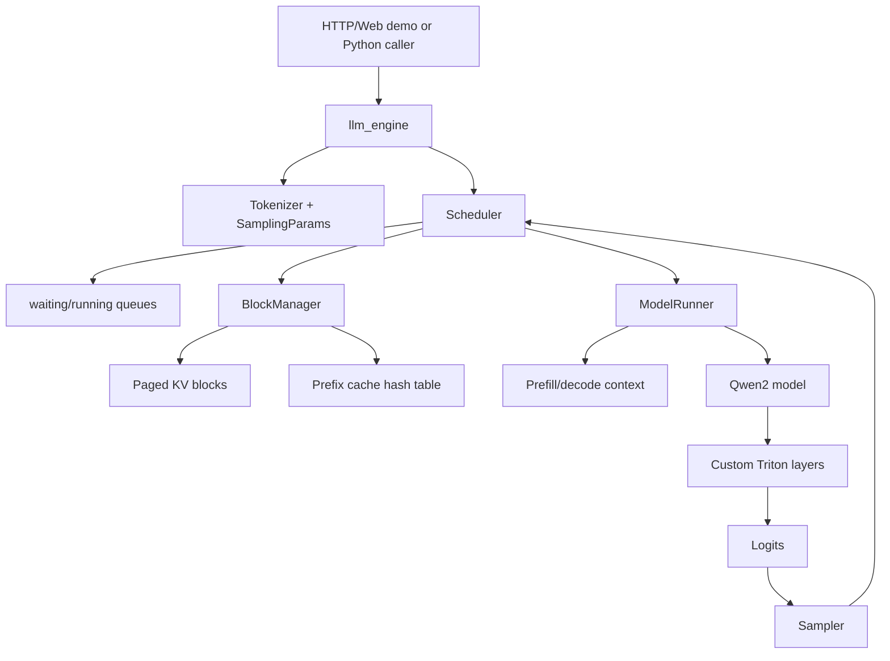
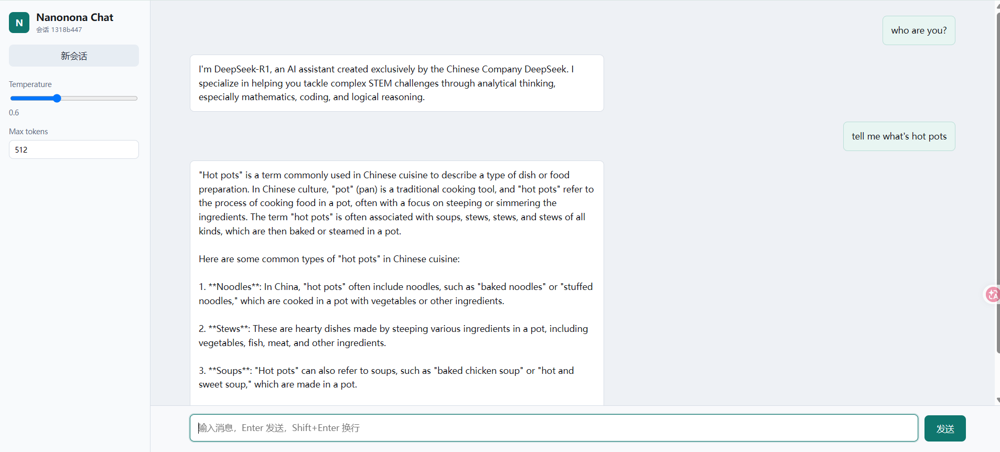

# Nanonona

中文 | [English](#english)

Nanonona 是一个以学习 AI infra 和大模型推理系统为目的的轻量级 LLM 推理框架。项目整体参考 nano-vllm 的控制流设计，实现了 continuous batching、paged attention、prefix cache，并用 Triton 手写了推理路径中的主要 CUDA 算子，包括 Linear、RMSNorm、RoPE、SwiGLU、prefill/decode attention 的相关逻辑。

这个项目不是生产级 vLLM 替代品。它是本人的一个可读、可测、可 benchmark 的推理引擎学习项目，用来学习从 CPU 调度层、KV cache 管理、模型结构拼装到 GPU kernel 实现的完整链路。

## 项目亮点

- 类 vLLM/nano-vllm 的 CPU 控制层：请求进入 waiting 队列，scheduler 按 prefill/decode 两阶段持续调度。
- Paged KV cache：KV cache 以 block 为单位管理，decode 阶段通过 block table 访问非连续 KV 存储。
- Prefix cache：对完整 block 的 token 前缀做链式 hash，复用已计算的 KV cache，减少共享前缀场景下的 prefill 计算。
- 自定义 Triton 算子：Linear、QKV/Gate-Up 合并线性层、SwiGLU、RMSNorm、RoPE、变长 prefill attention、paged prefill attention、decode attention。
- Qwen2 推理闭环：支持加载 Qwen2 架构 safetensors 权重，并针对 DeepSeek-R1-Distill-Qwen-1.5B / Qwen2 形态做测试。
- 可验证实验：包含机制正确性测试、算子正确性测试、Transformers 对齐测试、continuous batching/prefix cache 消融和 vLLM 对比。
- 轻量 Web Demo：基于标准库 HTTP server 和前端静态页面实现一个多会话聊天界面。

## 目录结构

| 路径 | 说明 |
| --- | --- |
| `nanonona/engine/` | CPU 控制层，包括 `llm_engine`、`Scheduler`、`ModelRunner`、`Sequence`、`BlockManager` 和 KV block 管理。 |
| `nanonona/layers/` | 推理层和 Triton 算子实现，包括 attention、linear、rmsnorm、rope、activation、embedding/lm head、sampling。 |
| `nanonona/models/Qwen2.py` | 将自定义层拼装成 Qwen2 decoder-only causal LM。 |
| `nanonona/utils/` | 配置读取、权重加载、采样参数和全局 attention context。 |
| `DS-R1-Distill-Qwen-1.5B/` | 模型配置和 tokenizer 文件。实际权重文件较大，建议本地或服务器单独放置，不提交到 GitHub。 |
| `config.yaml` | 项目运行配置，包括模型路径、block size、batch token 上限、GPU 显存利用率和 server host/port。 |
| `test/` | 功能和正确性测试。重点是 `test_mechanisms.py` 和 `test_ops_correctness.py`。 |
| `benchmarks/` | benchmark 脚本、实验命令说明和已保存结果。详见 `benchmarks/README.md`。 |
| `web/` | 前端聊天页面静态资源。 |
| `web_server.py` | Web demo 服务端，内部用 worker 队列把短时间窗口内的请求合并给推理引擎。 |

## 架构概览



核心执行流程：

1. `llm_engine` 读取 `config.yaml`，加载 tokenizer，并创建 `ModelRunner` 和 `Scheduler`。
2. `ModelRunner` 加载 Qwen2 配置和 safetensors 权重，先 warmup Triton kernel，再根据峰值激活显存和 `gpu_memory_utilization` 估算可分配 KV cache block 数。
3. 请求被封装为 `Sequence` 后进入 scheduler 的 waiting 队列。
4. scheduler 优先安排 waiting 请求做 prefill；如果 KV block 或 batch token 预算不足，则等待后续轮次。
5. 没有可 prefill 的新请求时进入 decode 阶段，按可用 KV block 安排 running 请求；必要时会 preempt 部分序列回 waiting 队列。
6. `BlockManager` 负责分配、释放、追加 KV block，并用完整 block 的 token hash 做 prefix cache 复用。
7. `ModelRunner` 根据 prefill/decode 阶段构造 attention context、slot mapping、block table、positions 和 input ids。
8. Qwen2 模型通过自定义 Triton 算子完成前向计算，sampler 产生下一个 token，scheduler 再更新序列状态。

## 环境依赖

建议使用 Linux + NVIDIA GPU + CUDA 环境运行。Triton kernel 和大部分测试都依赖 CUDA。

推荐 Python 版本：`>=3.10`。

先安装与你服务器 CUDA 版本匹配的 PyTorch，然后安装 Triton。例如 CUDA 12.1 环境可以参考：

```bash
pip install torch --index-url https://download.pytorch.org/whl/cu121
pip install triton
```

再安装项目依赖和本地包：

```bash
pip install -r requirements.txt
pip install -e .
```

`requirements.txt` 中没有强行固定 `torch` 和 `triton`，因为这两个包通常需要和服务器 CUDA/driver 版本匹配安装。

模型权重准备：

1. 将 DeepSeek-R1-Distill-Qwen-1.5B 或兼容 Qwen2 架构的 safetensors 权重放到 `DS-R1-Distill-Qwen-1.5B/`。
2. 或者修改 `config.yaml` 中的 `model.path` 指向你的本地模型目录。
3. 为了避免误传大文件，仓库的 `.gitignore` 会忽略 `*.safetensors`、`*.bin`、`*.pt` 等权重文件。

## 运行 Web Demo

```bash
CUDA_VISIBLE_DEVICES=0 \
TRITON_CACHE_DIR=./triton_cache_sm86 \
python web_server.py --host 0.0.0.0 --port 8000
```

启动后访问：

```text
http://localhost:8000
```

如果在远程服务器运行，把 `localhost` 替换为服务器 IP 或通过 SSH tunnel 访问。

Web demo 支持多个浏览器会话并发访问；服务端会用一个短暂的 batch delay 收集请求，然后一起交给 `llm_engine.generate()`。当前 demo 不持久化历史对话，刷新或新建会话只保留浏览器 session 级别状态。

<details>
<summary>Web UI 截图</summary>



</details>

## 正确性测试

机制测试：

```bash
TRITON_CACHE_DIR=./triton_cache_sm86 \
CUDA_VISIBLE_DEVICES=0 \
python -m unittest discover -s test -p "test_mechanisms.py"
```

该测试覆盖：

- prefix cache 对已释放完整 block 的复用；
- 运行中 block 的共享和 ref count；
- partial tail block 不进入 prefix cache；
- hash collision 下不会错误复用不同 token；
- continuous batching 的 prefill/decode 调度；
- KV block 不足时的 preemption；
- prefill/decode context、slot mapping、block table 构造。

其中有一个 `expectedFailure`，用于记录一个 scheduler 边界问题：cached prefill 的 admission check 理想情况下应该按未缓存 token 数判断，而不是先按完整 prompt 长度判断。

算子正确性测试：

```bash
TRITON_CACHE_DIR=./triton_cache_sm86 \
CUDA_VISIBLE_DEVICES=0 \
python -m unittest discover -s test -p "test_ops_correctness.py"
```

该测试会将自定义 Triton 实现与 PyTorch reference 对齐，覆盖 Linear、SwiGLU、RMSNorm、fused add RMSNorm、RoPE、KV cache 写入、compact prefill attention、prefix-cache paged prefill attention 和 decode attention。

更广泛的 shape bucket 覆盖：

```bash
NANONONA_EXTENSIVE_OP_TESTS=1 \
TRITON_CACHE_DIR=./triton_cache_sm86 \
CUDA_VISIBLE_DEVICES=0 \
python -m unittest discover -s test -p "test_ops_correctness.py"
```

## Benchmark 与实验结论

详细命令在 `benchmarks/README.md`，结果文件在 `benchmarks/results/`。以下是当前保存结果的摘要。

### Transformers 正确性对齐

配置：4 个 prompt，prompt length 64，greedy 生成 32 token。

| 指标 | 结果 |
| --- | ---: |
| logits top-1 match rate | 100% |
| logits top-k overlap avg, k=10 | 97.5% |
| logits cosine similarity avg | 0.9997 |
| greedy exact match rate | 100% |
| greedy token match rate avg | 100% |

这说明在当前模型和测试 prompt 下，nanonona 的 logits 排序和 greedy 生成结果可以与 Transformers reference 对齐。由于自定义 kernel 计算可能存在浮点误差，max/mean absolute error 仍会存在小幅数值差异。

### Continuous Batching

配置：32 个请求，每个 prompt 512 token，每个输出 128 token。

| 模式 | Batch makespan | Output tok/s | Total tok/s | Prefill steps | Decode steps |
| --- | ---: | ---: | ---: | ---: | ---: |
| serial | 208.78s | 19.62 | 98.09 | 32 | 4064 |
| continuous | 7.29s | 562.20 | 2810.99 | 2 | 127 |

在该固定长度场景下，continuous batching 将 batch 总完成时间从 208.78s 降到 7.29s，输出吞吐约提升 28.7 倍。串行模式的单请求 TTFT 更低，但整体吞吐和批量完成时间明显更差，这符合 LLM serving 中 batching 的典型权衡。

### Prefix Cache 消融

配置：32 个请求，共享 1024-token prefix，每个请求有 32-token suffix，输出 128 token。

| 模式 | Batch makespan | Output tok/s | Avg TTFT | Scheduled prefill tokens | Peak allocated blocks |
| --- | ---: | ---: | ---: | ---: | ---: |
| prefix cache off | 9.40s | 435.63 | 1.246s | 33792 | 160 |
| prefix cache on | 7.12s | 575.29 | 0.364s | 2048 | 36 |

prefix cache 将实际需要执行的 prefill token 从 33792 降到 2048，TTFT 下降约 3.4 倍，batch makespan 和输出吞吐约改善 1.32 倍，同时显著减少 KV block 占用。这验证了 prefix cache 在共享系统提示词、RAG 模板或多请求相同长前缀场景下的价值。

### 与 vLLM 对比

相同模型和 prompt 配置下，vLLM 仍然明显更快：

| 场景 | nanonona output tok/s | vLLM output tok/s | nanonona / vLLM |
| --- | ---: | ---: | ---: |
| fixed, vLLM default | 526.25 | 2315.90 | 22.7% |
| fixed, vLLM eager | 453.25 | 929.23 | 48.8% |
| shared-prefix, vLLM default | 581.32 | 3718.39 | 15.6% |

这部分结果的意义不在于追平 vLLM，而是定位学习型实现和成熟生产引擎之间的差距。vLLM 在 CUDA graph、kernel 融合、内存管理、调度策略和长期工程优化上都有大量积累；nanonona 的结果说明核心机制有效，但仍有明确优化空间。

## 当前限制与后续方向

- 当前主要围绕 Qwen2/DeepSeek-R1-Distill-Qwen-1.5B 推理路径实现，尚不是通用多模型框架。
- 只实现单机单卡推理，没有 tensor parallel、pipeline parallel 或分布式 serving。
- sampling 目前较简单，`SamplingParams` 主要支持 temperature、max_tokens、ignore_eos，还没有 top-k/top-p。
- Web demo 没有流式输出，也不持久化历史对话。
- prefix cache admission 还有一个已用 `expectedFailure` 记录的 scheduler 边界问题。
- benchmark 结果依赖服务器 GPU、CUDA、PyTorch/Triton/vLLM 版本和 warmup 策略，不应跨机器直接比较绝对值。

---

## English

Nanonona is a lightweight LLM inference framework built for learning AI infrastructure. It follows the high-level serving structure of nano-vllm and implements continuous batching, paged attention, prefix caching, and most inference-time GPU operators in Triton.

This repository is not intended to replace production engines such as vLLM. It is a compact, readable, testable project that demonstrates the full path from CPU-side scheduling and KV cache management to Qwen2 model assembly and custom CUDA kernels.

## Highlights

- CPU-side serving loop with waiting/running queues and prefill/decode scheduling.
- Paged KV cache managed by fixed-size blocks and block tables.
- Prefix cache based on chained hashes of full token blocks.
- Custom Triton kernels for Linear, merged QKV/Gate-Up projections, SwiGLU, RMSNorm, RoPE, varlen prefill attention, paged prefill attention, decode attention, and sampling-related paths.
- Qwen2 inference path with safetensors loading.
- Tests for scheduler mechanisms, prefix cache behavior, custom operators, and Transformers alignment.
- Benchmark scripts for continuous batching, prefix-cache ablation, Transformers correctness comparison, and vLLM throughput comparison.
- A minimal multi-session web chat demo.

## Repository Layout

| Path | Description |
| --- | --- |
| `nanonona/engine/` | CPU control plane: engine, scheduler, model runner, sequence state, block manager, and KV blocks. |
| `nanonona/layers/` | Inference layers and Triton kernels: attention, linear, RMSNorm, RoPE, activation, embeddings/head, sampling. |
| `nanonona/models/Qwen2.py` | Qwen2 decoder-only causal LM assembled from the custom layers. |
| `nanonona/utils/` | Config loading, safetensors loading, sampling params, and global attention context. |
| `DS-R1-Distill-Qwen-1.5B/` | Model config and tokenizer metadata. Large weight files should stay local and out of Git. |
| `config.yaml` | Runtime configuration for model path, KV block size, batching limits, GPU memory utilization, and server host/port. |
| `test/` | Unit tests for serving mechanisms and custom operators. |
| `benchmarks/` | Benchmark scripts, command examples, and saved result files. |
| `web/` | Static frontend for the chat demo. |
| `web_server.py` | Standard-library HTTP server with a small request-batching worker. |

## Installation

Use Linux with an NVIDIA GPU and CUDA. Python `>=3.10` is recommended.

Install PyTorch for your CUDA environment first, then install Triton. For example, with CUDA 12.1:

```bash
pip install torch --index-url https://download.pytorch.org/whl/cu121
pip install triton
```

Then install the remaining dependencies and the local package:

```bash
pip install -r requirements.txt
pip install -e .
```

Place the Qwen2-compatible safetensors checkpoint under `DS-R1-Distill-Qwen-1.5B/`, or update `model.path` in `config.yaml`.

## Web Demo

```bash
CUDA_VISIBLE_DEVICES=0 \
TRITON_CACHE_DIR=./triton_cache_sm86 \
python web_server.py --host 0.0.0.0 --port 8000
```

Open:

```text
http://localhost:8000
```

The demo supports multiple browser sessions. The server batches requests that arrive within a short delay window before sending them to `llm_engine.generate()`. Chat history is not persisted.

## Tests

Scheduler and mechanism tests:

```bash
TRITON_CACHE_DIR=./triton_cache_sm86 \
CUDA_VISIBLE_DEVICES=0 \
python -m unittest discover -s test -p "test_mechanisms.py"
```

Triton operator correctness tests:

```bash
TRITON_CACHE_DIR=./triton_cache_sm86 \
CUDA_VISIBLE_DEVICES=0 \
python -m unittest discover -s test -p "test_ops_correctness.py"
```

Broader operator bucket coverage:

```bash
NANONONA_EXTENSIVE_OP_TESTS=1 \
TRITON_CACHE_DIR=./triton_cache_sm86 \
CUDA_VISIBLE_DEVICES=0 \
python -m unittest discover -s test -p "test_ops_correctness.py"
```

`test_mechanisms.py` includes one `expectedFailure` that documents a scheduler edge case: cached prefill admission should ideally be checked against uncached tokens instead of total prompt length.

## Benchmark Summary

See `benchmarks/README.md` for commands and `benchmarks/results/` for raw outputs.

Transformers correctness comparison, using 4 prompts with 64 prompt tokens and 32 greedy generation tokens:

| Metric | Result |
| --- | ---: |
| Logits top-1 match rate | 100% |
| Logits top-k overlap avg, k=10 | 97.5% |
| Logits cosine similarity avg | 0.9997 |
| Greedy exact match rate | 100% |
| Greedy token match rate avg | 100% |

Continuous batching, using 32 requests, 512 prompt tokens per request, and 128 output tokens per request:

| Mode | Batch makespan | Output tok/s | Total tok/s |
| --- | ---: | ---: | ---: |
| serial | 208.78s | 19.62 | 98.09 |
| continuous | 7.29s | 562.20 | 2810.99 |

Continuous batching improves output throughput by about 28.7x in this fixed-length batch setting.

Prefix-cache ablation, using 32 requests with a shared 1024-token prefix, 32-token suffix, and 128 output tokens:

| Mode | Batch makespan | Output tok/s | Avg TTFT | Scheduled prefill tokens |
| --- | ---: | ---: | ---: | ---: |
| prefix cache off | 9.40s | 435.63 | 1.246s | 33792 |
| prefix cache on | 7.12s | 575.29 | 0.364s | 2048 |

Prefix cache reduces scheduled prefill tokens from 33792 to 2048 and lowers average TTFT by about 3.4x in this shared-prefix scenario.

vLLM is still much faster, as expected for a mature production engine:

| Scenario | nanonona output tok/s | vLLM output tok/s | nanonona / vLLM |
| --- | ---: | ---: | ---: |
| fixed, vLLM default | 526.25 | 2315.90 | 22.7% |
| fixed, vLLM eager | 453.25 | 929.23 | 48.8% |
| shared-prefix, vLLM default | 581.32 | 3718.39 | 15.6% |

The main takeaway is that the core mechanisms are functional and measurable, while mature engines still benefit from CUDA graphs, deeper kernel fusion, more sophisticated scheduling, memory management, and long-term engineering optimization.

## Limitations

- Mainly targets Qwen2-style inference and is not yet a general multi-model engine.
- Single-machine, single-GPU only.
- No tensor parallelism, pipeline parallelism, or distributed serving.
- Sampling currently focuses on temperature and max token limits; top-k/top-p are not implemented.
- The web demo has no streaming response and no persistent history.
- Benchmark numbers are hardware and software stack dependent.

## Publishing

See `docs/GITHUB_PUBLISHING.md` for a practical checklist. In short, keep model weights and cache directories out of Git, commit the code/docs/results you want to show, create a public GitHub repository, and push the local branch to `origin`.
